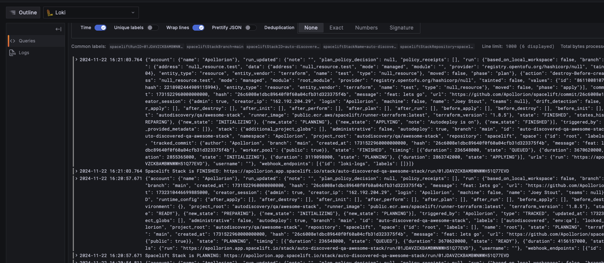

# Plugin Loki

This module adds the `loki` plugin to your Spacelift account. It will send logs, with information about the run, to Loki.

**Note:** 
There is currently a limitation in the Spacelift API that prevents sending the actual log output to Loki. 
This means that you will only see metadata about the run, such as the run ID, the stack ID, the status of the run, etc.
You will **not** see the actual logs of a run.

## Usage

1. Spin up the module (see examples below)
2. Add the `plugin_loki` label to any stack.

The labeled stacks will automatically send logs to Loki.




<!-- BEGIN_TF_DOCS -->
## Example

```hcl
module "plugin_loki" {
  source = "spacelift.io/spacelift-solutions/plugin-loki/spacelift"

  # Required Variables
  loki_endpoint = "https://loki.example.com/loki/api/v1/push"
  space_id      = "root"

  # Optional Variables
  name_suffix    = "loki"
  policy_labels  = ["production"]
  webhook_labels = ["production"]
}
```

## Inputs

| Name | Description | Type | Default | Required |
|------|-------------|------|---------|:--------:|
| <a name="input_loki_endpoint"></a> [loki\_endpoint](#input\_loki\_endpoint) | The endpoint of the Loki instance to send logs to.<br/>Example: https://{your-publicly-facing-loki-endpoint}/loki/api/v1/push | `string` | n/a | yes |
| <a name="input_name_suffix"></a> [name\_suffix](#input\_name\_suffix) | Suffix to append to the name of the resources | `string` | `""` | no |
| <a name="input_policy_labels"></a> [policy\_labels](#input\_policy\_labels) | Labels to apply to the policy | `list(string)` | `[]` | no |
| <a name="input_space_id"></a> [space\_id](#input\_space\_id) | The ID of the Space to create the resources in | `string` | n/a | yes |
| <a name="input_webhook_labels"></a> [webhook\_labels](#input\_webhook\_labels) | Labels to apply to the webhook | `list(string)` | `[]` | no |
<!-- END_TF_DOCS -->
